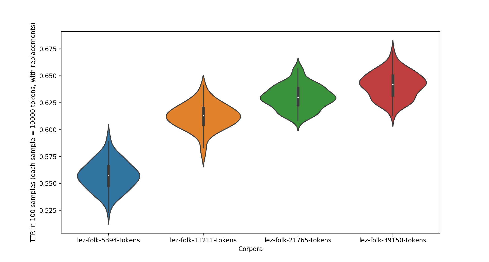

# TTR in samples from corpora of different size

### Each sample ~ 1000 tokens. With replacements.

Russian.

Lezgian.

### Each sample ~ 300 tokens. With replacements.

Russian.

Lezgian.

### Each sample ~ 1000 tokens. Without replacements.

Russian.

Lezgian.

### 100 samples. Each sample - exactly 1000 tokens. Without replacements.

Russian.

Lezgian.

