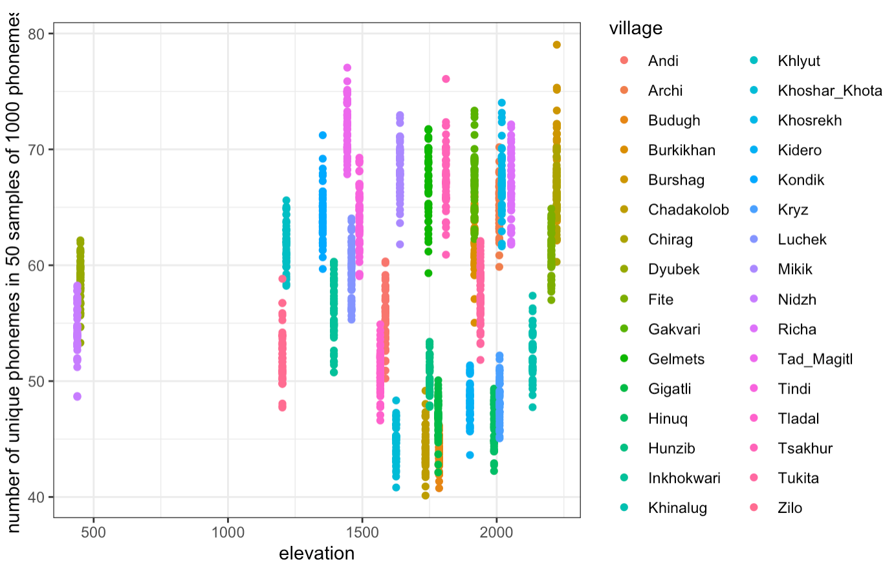
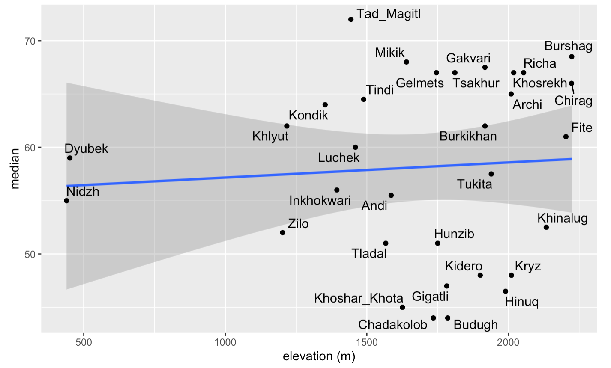
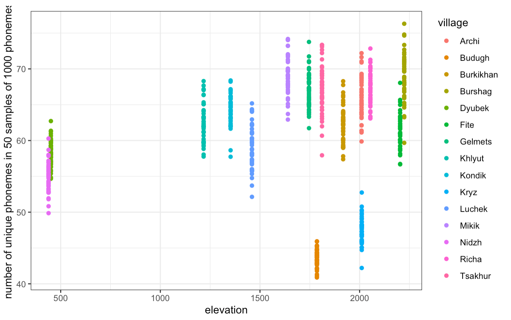
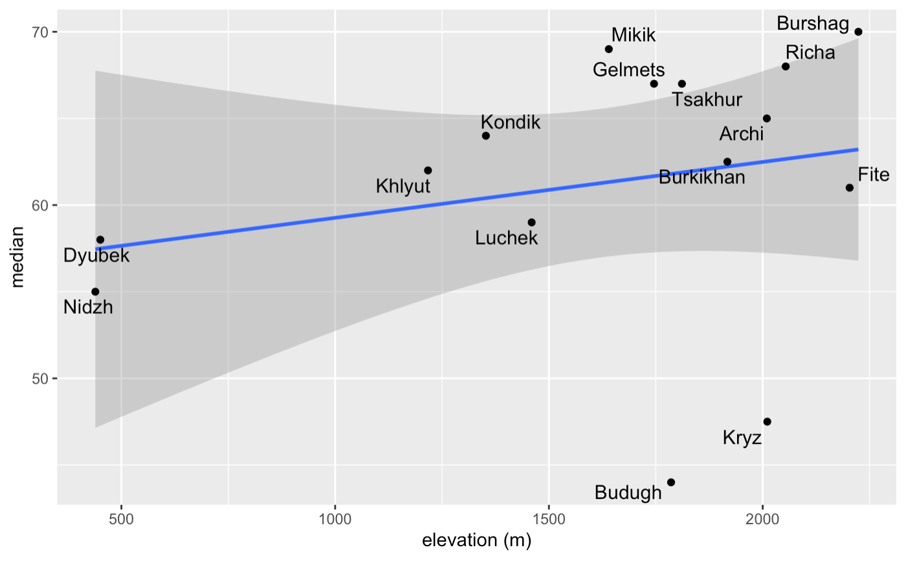
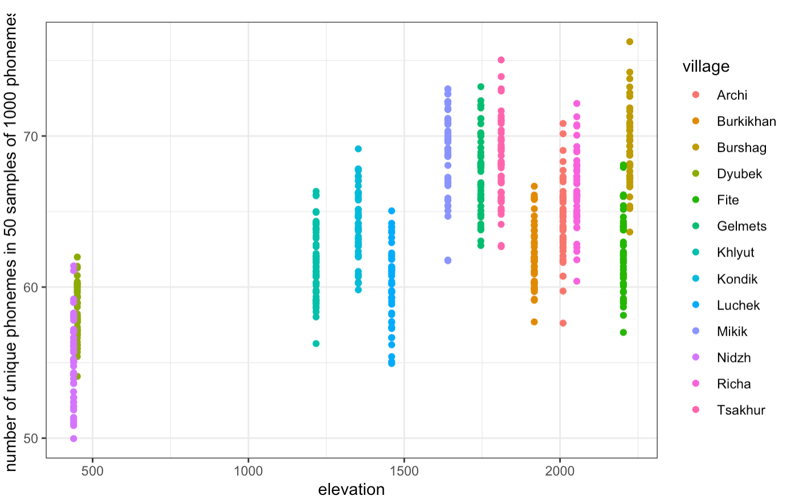
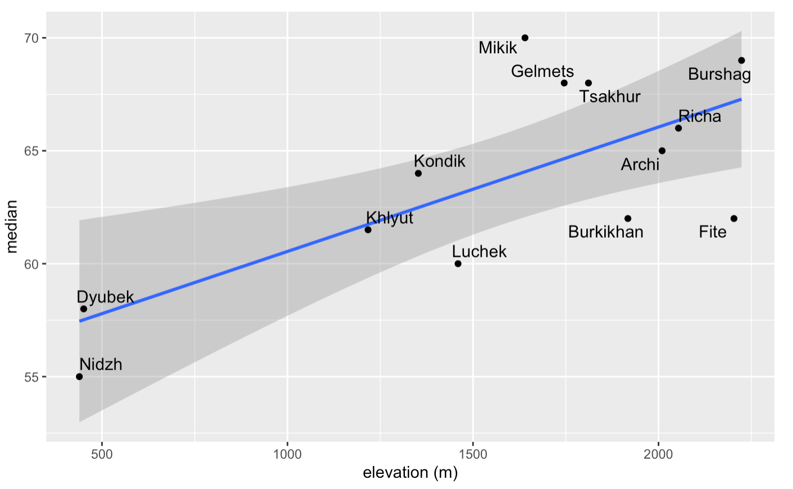
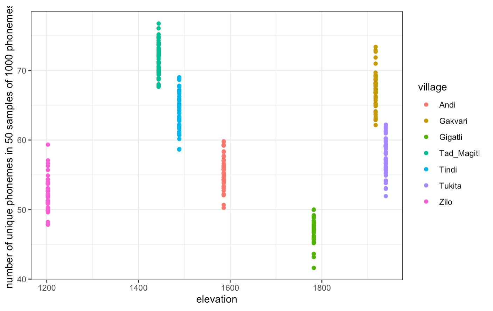
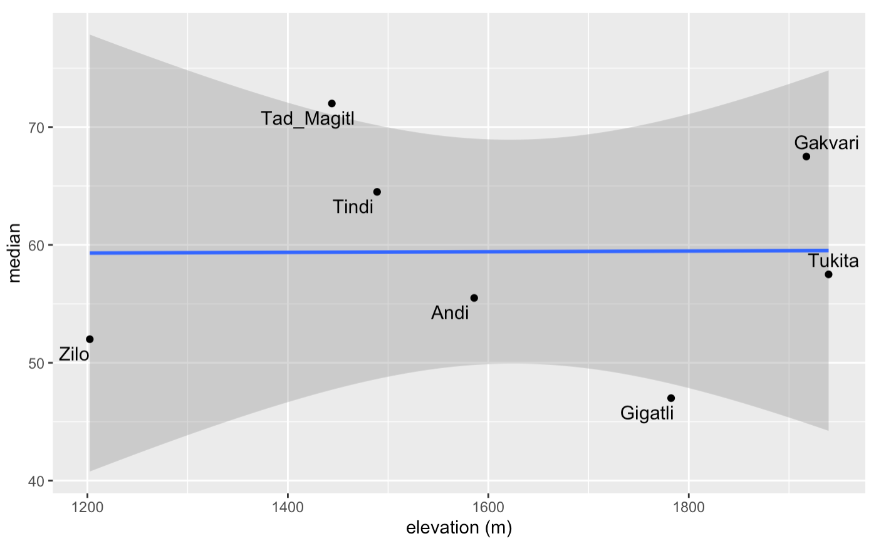
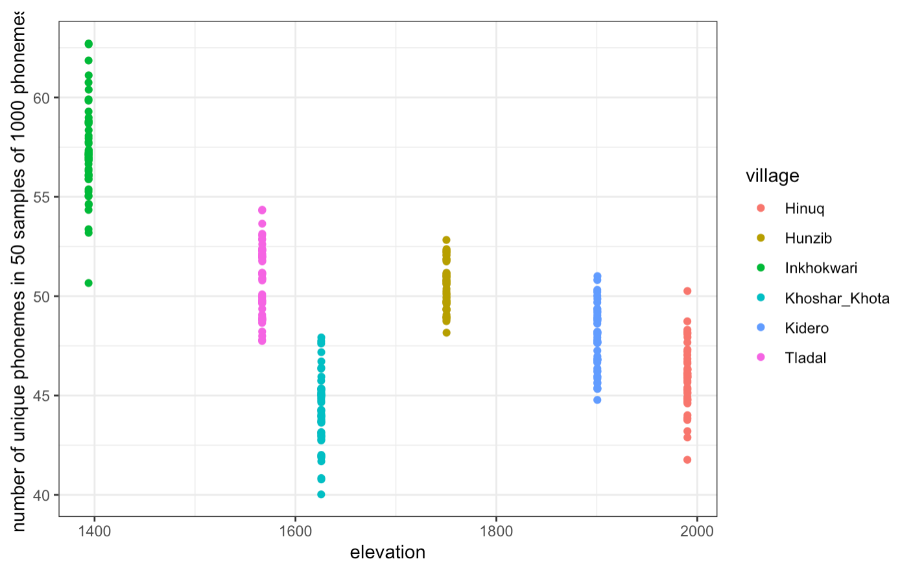
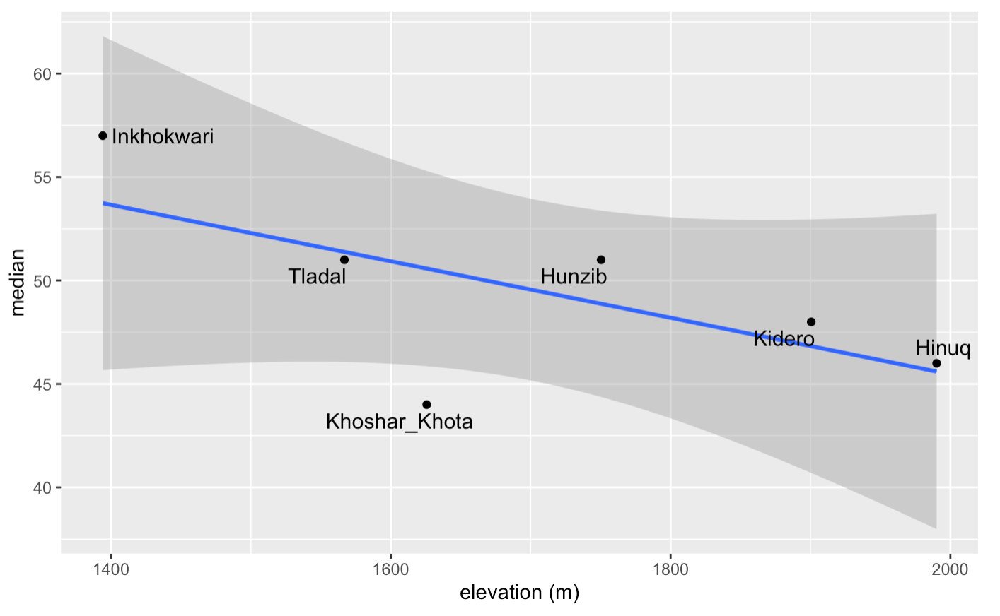

# Phonological inventory and altitude

Phonological inventory is measured as the number of unique phonemes in a sample of words. The total length of each word-sample is about 1000 phonemes.

All villages in the sample (distribution).

All villages in the sample (median).

Lezgic (distribution).

Lezgic (median).

Lezgic without Kryz and Budugh (distribution).

Lezgic without Kryz and Budugh (median).

Andic (distribution).

Andic (median).

Tsezic (distribution).

Tsezic (median).

